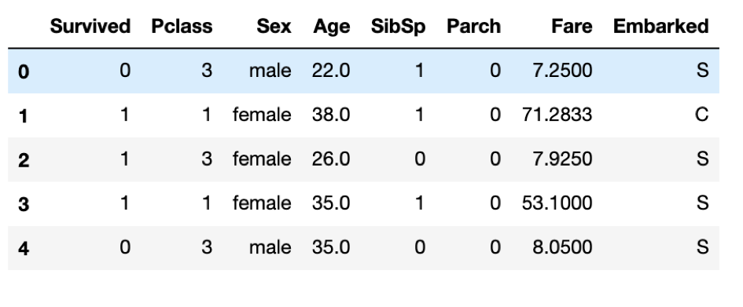

## Predicting Titanic Survivors with Machine Learning

1.Get Data Overview. 
2.Drop unrelated feature, and features with too many missing value. 
{:height="50%" width="50%"}
3. Visualizing survived and failed people. 
{:height="50%" width="50%"}
{:height="50%" width="50%"}
{:height="50%" width="50%"}
{:height="50%" width="50%"}
{:height="50%" width="50%"}
4. Drop unrealated features and add new feature. 
5. Traning with different algorithms. 
6. Prediction accuracy: 86.81%. 

