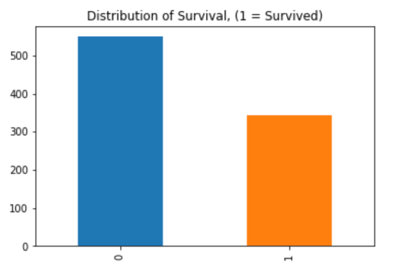
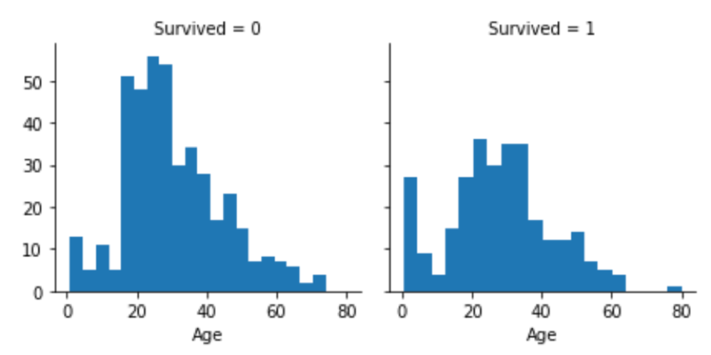
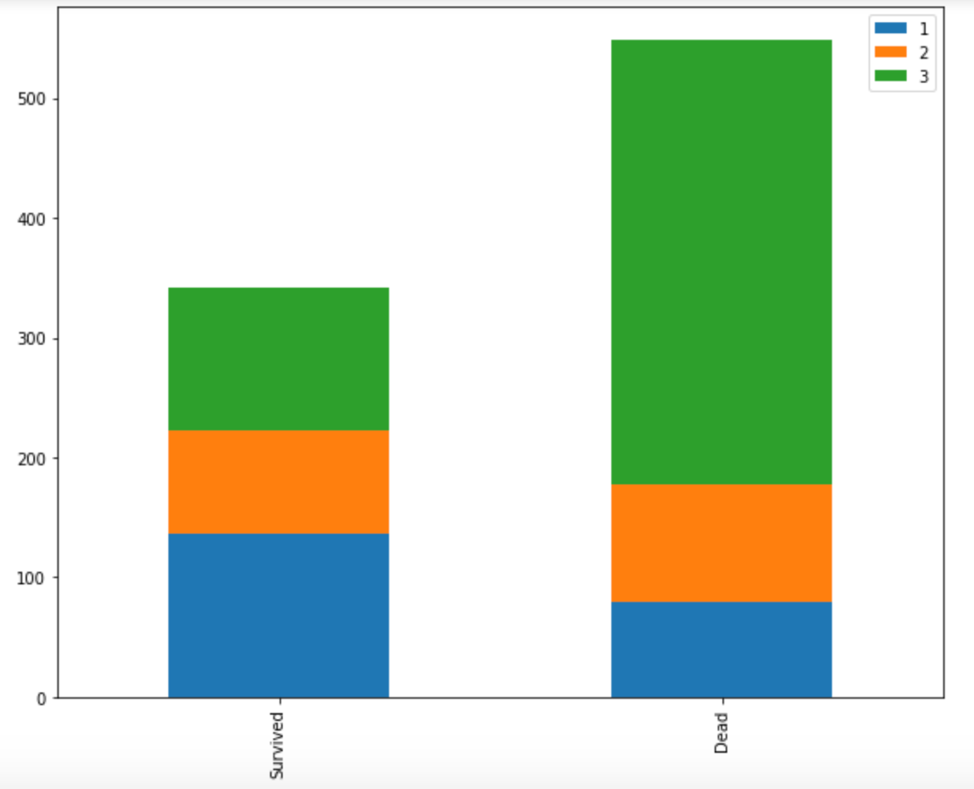
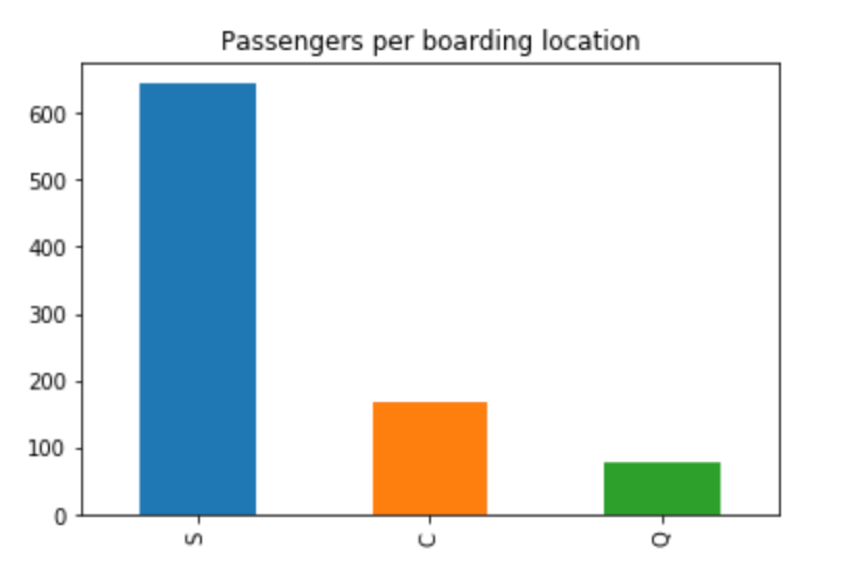
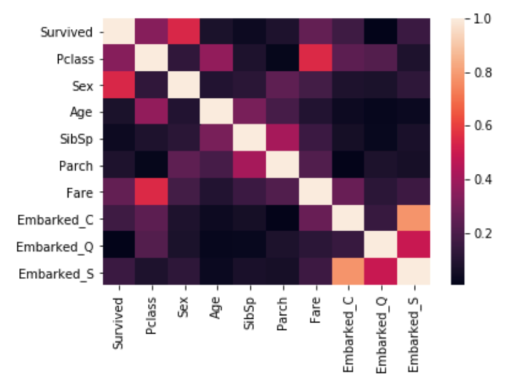

## Predicting Titanic Survivors with Machine Learning

1.Get Data Overview. 
2.Drop unrelated feature, and features with too many missing value. 

3. Visualizing survived and failed people. 

4. Drop unrealated features and add new feature. 
5. Traning with different algorithms. 
6. Prediction accuracy: 86.81%. 

